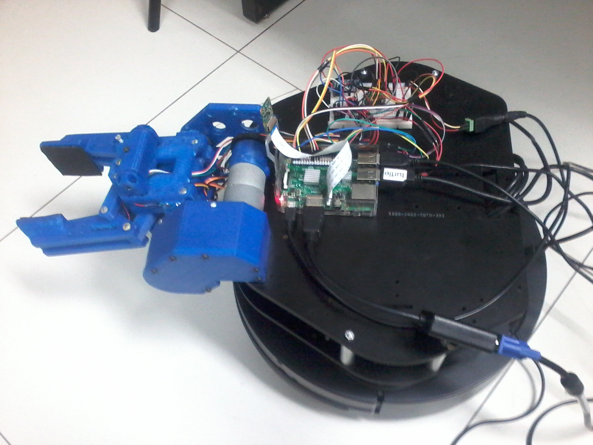

# ZZ-Gripper v2.0

#### Introdução:
Robô desenvolvido no Laboratório de Sistemas Autônomos, [LSA](https://lsa-pucrs.github.io/), da FACIN na PUCRS.
Esta gripper foi desenvolvida no laboratório visando aplicações _pick-and-place_ em conjunto com o robo Turtlebot V2.

### Diferenças entre a V1.0 e V2.0
+ troca de um Arduino por uma Raspberry Pi 3
+ uso de câmera + OpenCV para processamento de imagem básico (blob finder)
+ firmware baseado em Python e ROS

#### Especificações:
+ Microprocessador: Raspberry Pi versão 3
+ Câmera Raspberry Pi versão 2
+ Driver: TB6612-Dual Motor Driver
+ Atuadores: 2 Graus de liberdade
+ Sensores: Sensor de força, sensor ultrasônico, sensor de corrente
+ Força aplicada a objeto: ~500g
+ Peso máximo de sustentação: ~700g

#### Lista de Materiais:
+ 2 Servos motores Tower PRO 996R
+ 1 Motor DC Pololu 50:1 37Dx54L  
+ 1 Sensor ultrassônico HC-SR04  
+ 1 Sensor Força FSR 406
+ 1 Sensor de Corrente ACS712
+ 1 Conversor Analógico Digital 4 canais ADS1115
+ Câmera Raspberry Pi v2 8MP

#### Instalação do driver:
**Versão Raspberry:**
As instruçoes de instalação serão adicionadas no [site](http://zz-gripper.readthedocs.io/en/imr-2017/)

**Versão Arduino:**
As instruções de instalação do driver para utilizar o robô com  no Readme do branch [hydro-devel](https://github.com/lsa-pucrs/zz-gripper/tree/hydro-devel).

