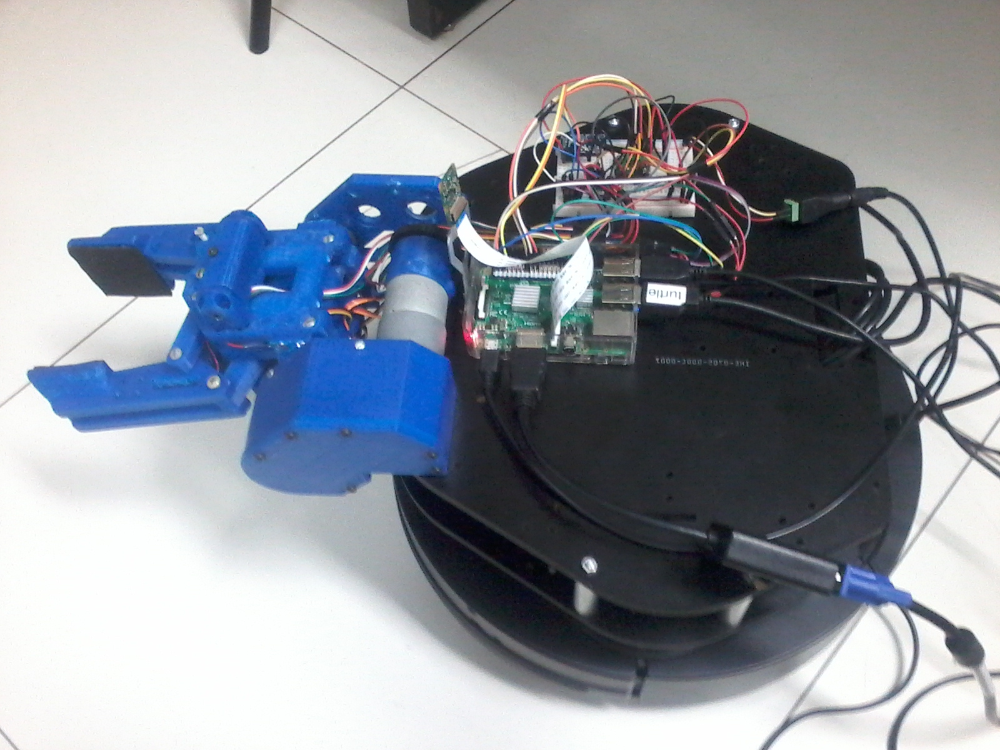

==========================
Welcome to LSA's ZZ-Gripper
==========================

About the Gripper
-----------------

.. image:: ./source/images/zz-gripper-turtle.jpg
    :align: center

This is the oficial documentation for Inteligent Gripper for Turtlebot based on Raspberry Pi 3.
It was made in the autonomous systems laboratory, LSA, of FACIN at PUCRS. 

Summary
--------------------------------------

.. toctree::
   :maxdepth: 3
    
   source/hardware/index
   source/software/index
   source/testing/index
   source/contributors/index

Disclaimer
----------

The purpose of this document is for the use of `LSA <https://lsa-pucrs.github.io/>`_ group only, but we open it in case it can be usefull for someone else.
Thus, we dont fill obliged to give any technical support, although we might help in some special situations.

Everything you find here is without absolutly no waranty and I'm not responsible for any inconveniences or issues that might occurs. 

Feedback
--------

Don't hesitate to ask about some additional info or next guides and also if you find some mistakes, please let me know.
This can be done by submitting an issue or a push request on github.

