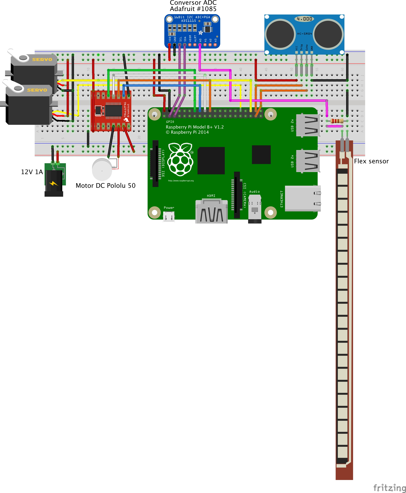

===============
Setting Up the Hardware
===============

Gripper robot was designed with microprocessor `Raspberry Pi version 3 <https://www.raspberrypi.org/>`_. 
You will find a guide to setting up the hardware: Raspberry Pi and circuit schematic.

  
.. WARNING::

  @ To be done !!! place here the fritzing schematics and 
  

    
Hardware Specification
============
 + Microprocessador: Raspberry Pi 3
 + Raspberry Pi Camera version 2
 + Motor Driver: TB6612-Dual Motor Driver
 + 2 Servos motores Tower PRO 996R
 + 1 Dc Motor Pololu 50:1 37Dx54L  
 + 1 Ultrasonic sensor HC-SR04  
 + 1 Sensor Força FSR 406
 + 1 Current sensor  ACS712
 + 1 Analog-Diginal converter with 4 channels ADS1115

